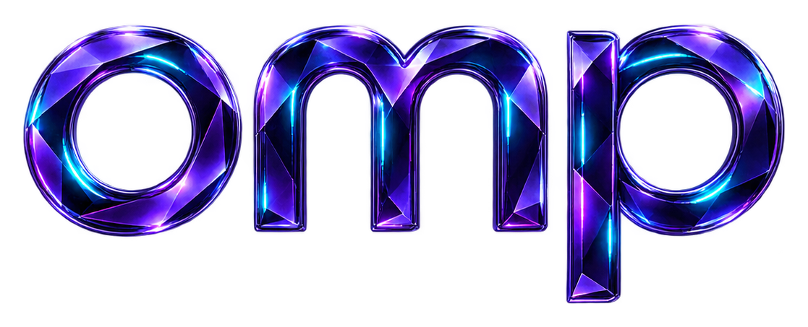

<p align="center">
  
</p>

<h1 align="center">Oh My Pi</h1>

<p align="center">
  
  
  
  <a href="LICENSE"></a>
</p>

A portable personal configuration for [Oh My Pi](https://github.com/can1357/oh-my-pi): deliberate model roles, an Exa-first web-search order, terminal theme preferences, enabled native image generation, and a small set of reusable skills.

It is for people who want a consistent OMP environment across hosts without sharing authentication, session history, caches, or local runtime state.

- **Research and discovery** — primary-source research, Scorch, browser automation, and skill discovery.
- **Design and images** — Fractal Tess visual direction, concise README authoring, Impeccable, frontend taste, and image generation.
- **Engineering** — Rust, Svelte, and React Bits guidance.

## Try it

After installing the configuration, start OMP and invoke a skill directly when useful:

```text
/skill:research Compare these two APIs using their official documentation.
```

```text
/skill:fractal-tess-visual-style Write an image direction for a privacy-first developer tool.
```


See [INSTALL.md](INSTALL.md) for setup on a new or existing host. Upstream OMP documentation lives at [omp.sh](https://omp.sh).

## License

Original configuration, documentation, assets, and Fractal Tess-authored skills are [MIT licensed](LICENSE). Copied skills retain their upstream terms.
